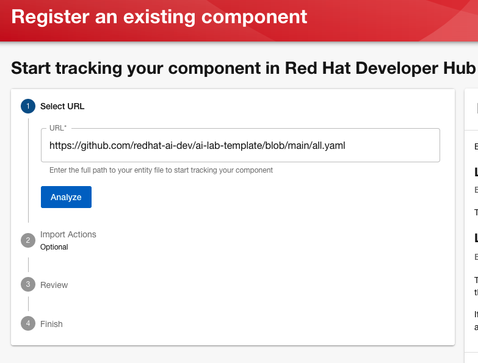
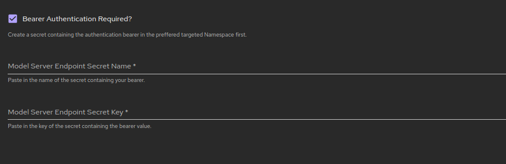

#  AI-lab Software Templates

> [!IMPORTANT]  
> The software templates in this repository require OpenShift Pipelines and OpenShift GitOps installed, along with their respective plugins in Red Hat Developer Hub. For more information on configuring them, please see [ai-rhdh-installer](https://github.com/redhat-ai-dev/ai-rhdh-installer/tree/release-v0.9.x).

## Usage in Red Hat Developer Hub

To import these templates click `Register Existing Component` on the Software Templates page.


Import `https://github.com/redhat-ai-dev/ai-lab-template/blob/main/all.yaml`



### Bearer Authentication support for "Bring Your Own Server" cases

Bearer authentication is supported when a user wants to use an existing model server. The process is the following:

* A secret storing the authentication bearer should be already created in the targeted Namespace (e.g the Namespace that the software template will be deployed to).

* On the software template installation wizzard, click on the `Bearer Authentication Required?` field.

* Fill in the name of your secret and the key that the bearer value is stored.




## Usage in Backstage 

Add the following to your `app-config.yaml` file in your Backstage configuration:

``` 
    - type: url
      target:  https://github.com/redhat-ai-dev/ai-lab-template/blob/main/all.yaml
      rules:
        - allow: [Location, Template]
```

This will add the samples into a set of Backstage templates.


## On-prem Host Support

You need to ensure the on-prem host is being configured in the `app-config.yaml` file in your Backstage/RHDH configuration.

### Change Default Host for Git or Quay

The [properties](./properties) file holds the default host for GitHub, GitLab and Quay.

Modifying the value and running `./generate.sh` will generate new templates with the customized default value.

### Providing On-prem Host Value When Creating a Component

On the `Application Repository Information` page provide your Git host under the `Repository Server` input.

**Note:** Please ensure the correct `Host Type` is selected.


On the `Deployment Information` page provide your Quay host under the `Image Registry` input.


 
## Contributing

The templates are found in [./templates](./templates) and reference reusable content in [./skeleton](./skeleton).  

The templates are maintained by importing external samples into the software template format. This allows the external samples to be used standalone, developed, and evolved and then imported.

The pipelines are also maintained externally to allow standalone use outside of software templates, as well as evolution of the pipelines in one or more software templates.

To update the templates from these or any new samples you update the list of imported repos and run the following: 

 [`./generate.sh`](./generate.sh) to generate all the templates before committing to this repository.

 [`import-ai-lab-samples`](./scripts/import-ai-lab-samples), [`import-gitops-template`](./scripts/import-gitops-template) and [`update-tekton-definition`](./scripts/import-gitops-template) take `repourl` and `branch` name as environment variables when running the scripts. 

 The following can be set respectively:

 `SAMPLE_REPO`/`GITOPS_REPO`/`PIPELINE_REPO` and `SAMPLE_BRANCH`/`GITOPS_BRANCH`/`PIPELINE_BRANCH`


## Troubleshooting

### MacOS 

Due to differences between Linux and MacOS, the GNU version of `sed` is required to be installed.

```
brew install gnu-sed
```
After this, alter PATH. For example, add the following line to your `~/.bash_profile`:
```
export PATH="/opt/homebrew/opt/gnu-sed/libexec/gnubin:$PATH"
```

### TechDocs Images

If you encounter images within TechDocs not properly rendering on Red Hat Developer Hub you may need to ensure they are located in a sub-directory named `/images` within `/docs`. 

For example: `/docs/images`.