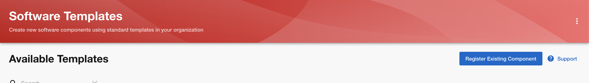
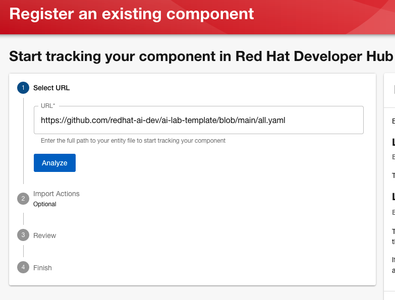
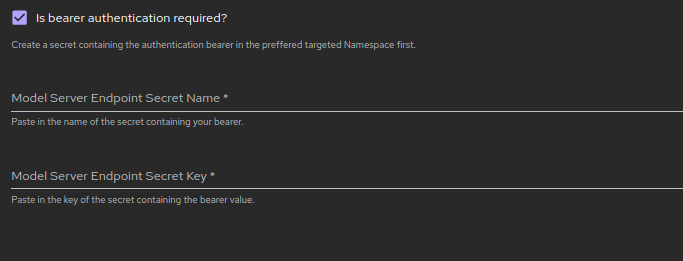
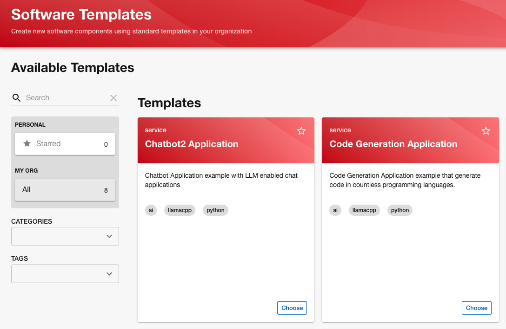
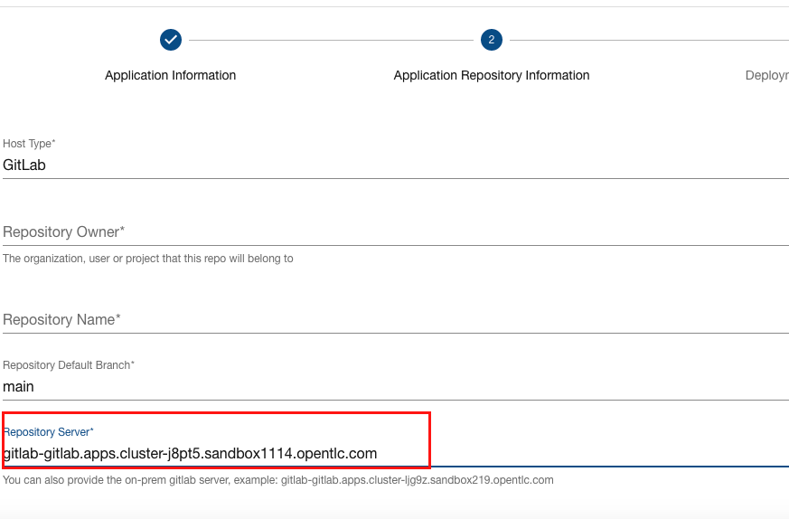
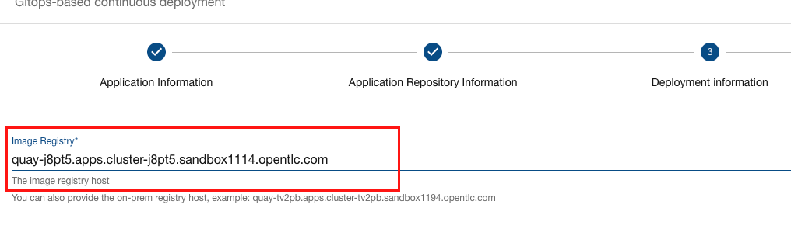

# USAGE

## Prerequisite

### Red Hat Developer Hub

The AI Software Templates have been tested on Red Hat Developer Hub release 1.2+.

### Backstage

The AI Software Templates should work on Backstage version 1.26.5+.

## Usage in Red Hat Developer Hub

To import these templates click `Register Existing Component` on the Software Templates page.



Import `https://github.com/redhat-ai-dev/ai-lab-template/blob/main/all.yaml`



### Bearer Authentication support for "Bring Your Own Server" cases

Bearer authentication is supported when a user wants to use an existing model server. The process is the following:

* A secret storing the authentication bearer should be already created in the targeted Namespace (e.g the Namespace that the software template will be deployed to).

* On the software template installation wizzard, click on the `Bearer Authentication Required?` field.

* Fill in the name of your secret and the key that the bearer value is stored.




## Usage in Backstage 

Add the following to your `app-config.yaml` file in your Backstage configuration:

``` 
    - type: url
      target:  https://github.com/redhat-ai-dev/ai-lab-template/blob/main/all.yaml
      rules:
        - allow: [Location, Template]
```

This will add the samples into a set of Backstage templates.




## On-prem Host Support

You need to ensure the on-prem host is being configured in the `app-config.yaml` file in your Backstage/RHDH configuration.

### Change Default Host for Git or Quay

The [properties](../properties) file holds the default host for GitHub, GitLab and Quay.

Modifying the value and running `./generate.sh` will generate new templates with the customized default value.

### Providing On-prem Host Value When Creating a Component

On the `Application Repository Information` page provide your Git host under the `Repository Server` input.

**Note:** Please ensure the correct `Host Type` is selected.



On the `Deployment Information` page provide your Quay host under the `Image Registry` input.

