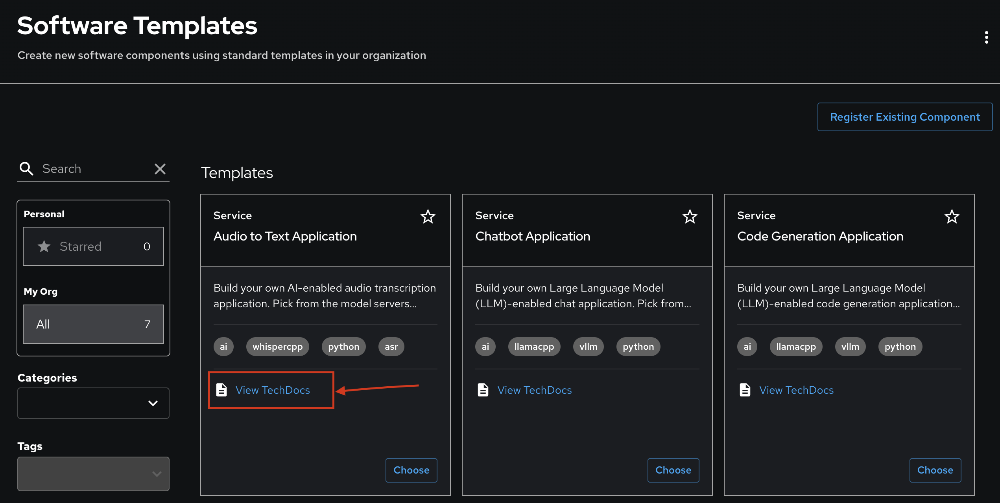

# Template Specific Documentation

This directory holds all Tech Docs that are specific to each AI Software Template.

You can find the following Tech Docs for AI Software Templates:
* Templates that deploy applications: [/app](./app/)
* Templates that do not deploy applications: [/no-app](./no-app/)

The Tech Docs contained in this directory are packaged alongside the Template content as they are designed to show up on the Template Card themselves. You can find an example of this below:

