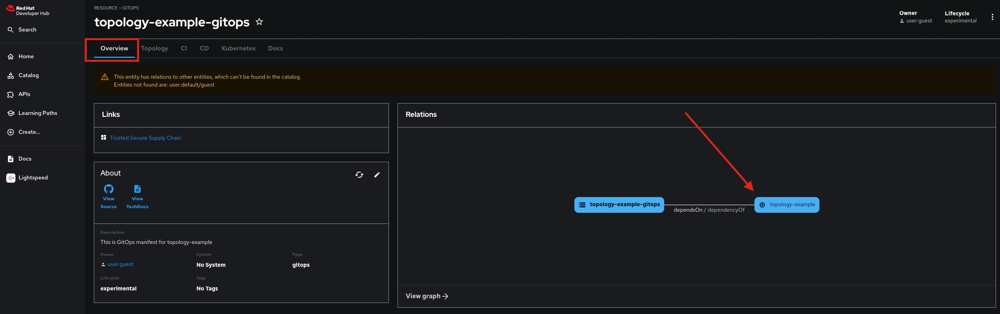

# AI Software Template Gitops

This repository contains the necessary content required for managing GitOps. It was created as part of an AI Software Template. The associated source component is available for reference in the **Overview** tab. You can find an example of this reference in the following image.

# Deployed Resources


During the template setup a custom model server was entered. Therefore, no model server was deployed by this application.


Based on the input from the AI Software Template, a deployment with the following characterisics was made:

# Model Server
**Model Server:** [${{ values.modelServerName }}]( ${{ values.modelServiceSrcVLLM }}  ${{ values.modelServiceSrcOther }} )

**Port:** ${{ values.modelServicePort }}





# Application
An application built from ${{ values.srcRepoURL }} will be stored in [${{ values.imageRegistry }}/${{ values.imageOrg }}/${{ values.imageName }}](https://${{ values.imageRegistry }}/${{ values.imageOrg }}/${{ values.imageName }}) and deployed through GitOps. This application is accessible on port **${{ values.appPort }}**.

