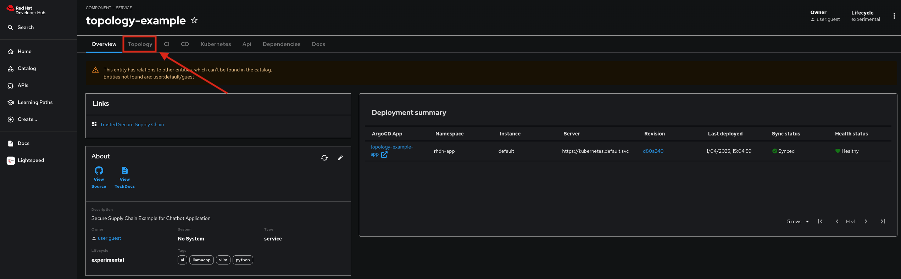
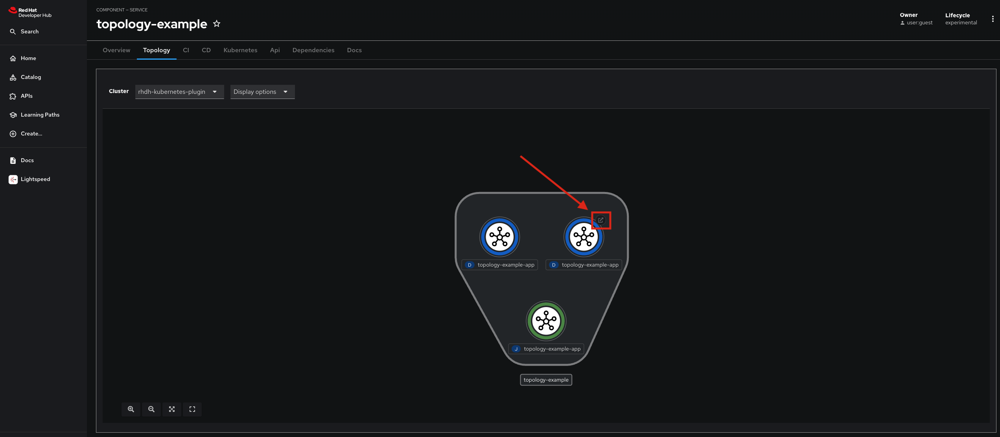

# **Introduction**

Congratulations! You deployed an application from an AI Software Template. The template has created a new source code repository for the application code, as well as a new GitOps deployment repository to handle deployment related tasks.

!!! info

    **Source Code Repository:** [${{ values.srcRepoURL }}](${{ values.srcRepoURL }})

    **GitOps Repository:** [${{ values.repoURL }}](${{ values.repoURL }})

# **Usage**

To access the ${{ values.name }} application that was deployed using the Software Template, complete the following instructions:

!!! tip

    All of this information can be found as part of your deployed **Component** in the Red Hat Developer Hub (RHDH) UI!

You can view the Topology of deployed resources by navigating to the **Topology** tab in your RHDH ribbon:

From that view, to navigate straight to your sample application, you can click the arrow on the resource of the application.

!!! info

    If you are met with a placeholder web page your application may still be building and has not yet been deployed! You can verify this by checking the **CI** tab to see if all related pipeline tasks have completed.

# **Model & Model Server Information**


You chose to provide your own model server. As part of providing your own server, you have to provide a useable model. The following model name is accessible through your model server endpoint:

- ${{ values.customModelName }}

!!! info

    These Tech Docs can be included in *public* repositories. Due to this we have omitted the model server URL for your security.


You chose to use the provided model that comes with this AI Software Template. As a result the following model was deployed for your use:

- [${{ values.modelName }}](${{ values.modelSrc }})

In order to access this model the template deployed a model server. You chose **[${{ values.modelServerName }}]( ${{ values.modelServiceSrcVLLM }}  ${{ values.modelServiceSrcOther }} )** as your server.


# **Deployment Information**

If you are interested in seeing the deployed Kubernetes resources, all resources were deployed into your chosen namespace of ${{ values.namespace }}. You can access this namespace through the web console or via your CLI.

!!! tip

    You can also login to your ArgoCD server to see the Argo view for deployed resources, such as your application itself!
