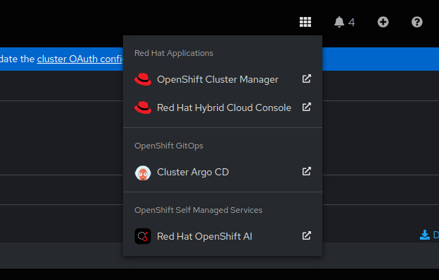
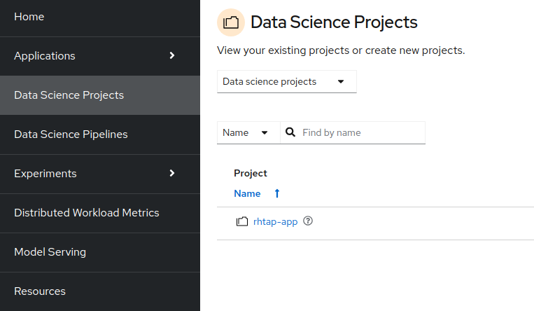
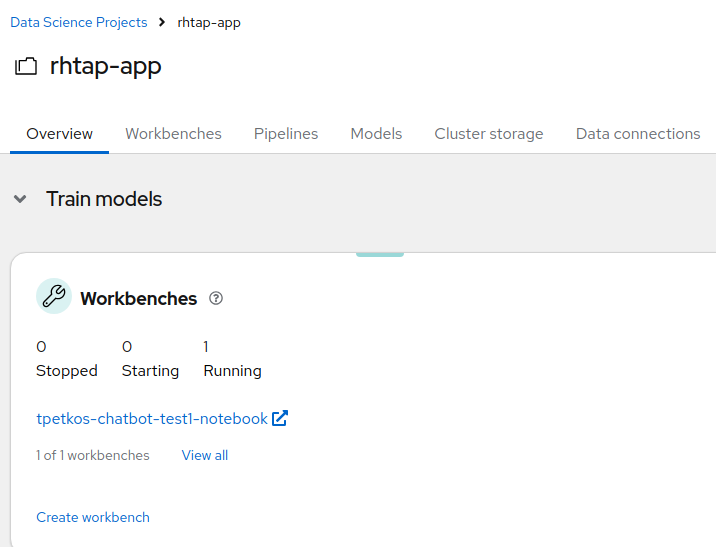
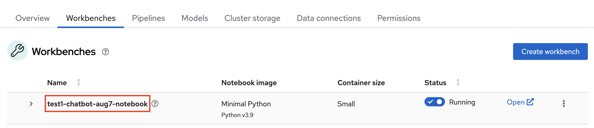

# Running Samples in OpenShift AI

This document will outline how you can run build and run your sample applications within an OpenShift AI workbench.

## Prerequisites

- Red Hat OpenShift AI installed, and `Create workbench for OpenShift AI` selected during component creation.
- `oc` cli installed
   - `oc` can be downloaded from https://mirror.openshift.com/pub/openshift-v4/clients/ocp/stable/
- Permissions to run `oc port-forward` on the cluster, specifically an account with the following roles:
   - `get`, `create`, and `list` for the `pods/portforward` subresource

## Running the Sample

1) While on Console, navigate to the `OpenShift AI`

2) Go to the `Data Science Projects` section and access your application's project

3) Access the `workbench`

4) Go to `File->Open` and select `Terminal`

5) In the terminal, run `cd ${{ values.name }}` to navigate to your sample app's directory

6) Run `pip install --upgrade -r requirements.txt` to install the dependencies for your application

7) Run `${{ values.appRunCommand }}` to run the sample in the workbench.

## Accessing the Sample

With the sample app now running, the following steps will allow you to access the sample app in your browser:

1) Navigate back to the OpenShift AI dashboard, and find the name of your workbench.

2) In a terminal window on your machine, run `oc get pods -l app=<workbench-name>`. This will retrieve the name of the pod where the workbench is running.

3) Run `oc port-forward <pod-name> ${{ values.appPort }}` to port forward the sample application's port to your local machine.

4) Finally, visit `http://localhost:${{ values.appPort }}` in your browser to access the application.